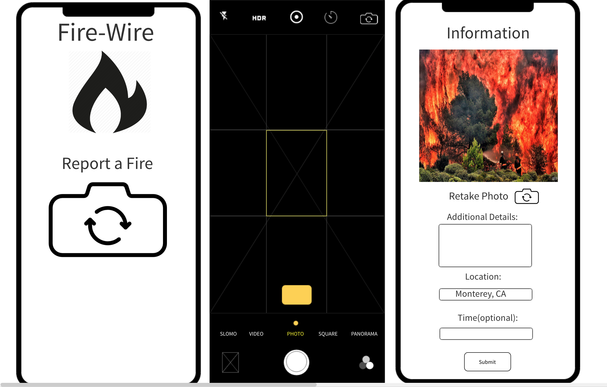
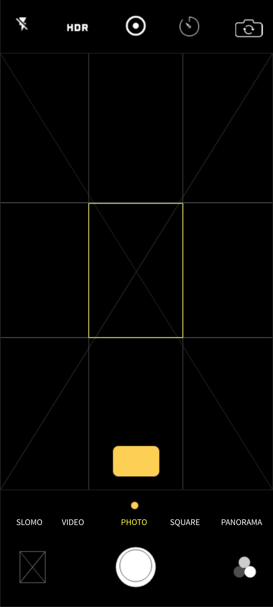

#About Fire-Wire

##The Concept

Our team, Fireflies, created this app for this 2018 NASA Space Apps Challenge: https://2018.spaceappschallenge.org/challenges/volcanoes-icebergs-and-asteroids-oh-my/real-time-fire-app/details

In order to empower the public to engage in wildfire prevention and detection, we envisioned an app where users could upload an image of a fire and their location to report a fire that they find while hiking or fishing or camping. Since our intended users are outdoors, we thought the best access point for such an app would be through the use of a smartphone. Thus, we have created the foundation of the app 'Fire-Wire'.

##The Data Journey

When the user takes a photo in our app, inputs a location, and submits it, the image and location data travels to our hand-made database, which is populated with NASA fire data from this website: https://firms.modaps.eosdis.nasa.gov/active_fire/#firms-shapefile. Once it is there, we cross-check the user's location with the locations of known fires. 

If the location matches that of an existing fire that NASA is aware of, we then pass the image through the Google Vision API to ensure that the image is both of a fire and not of something inappropriate. 

If the image is of a fire and not something inappropriate, we then hand off the data to the Twitter API, which we use to post a tweet with the location and image, in order to alert the public to the fire's impact. At this stage, we also would notify local authorities with the photo and geolocation of the user. Finally, we would alert other users in the area through our app with the relevant fire information.

##Challenges

The biggest challenge for us was that the current NASA fire data is only available (as far as we can tell) in the form of a downloadable file from their website, so Mark (https://github.com/marcusp619) and Anita (https://github.com/swesoc) had to collaborate to build a back-end for our app from scratch. Anita suggested that we use data from more sources to notify users of fire risk, but we wanted to try to integrate NASA data in our app as much as possible, since this challenge is a NASA challenge.

Another unfortunate headwind was the restrictions with using the Google Vision API. In order to use the Vision API, we would have had to enable billing, which is not a cost that any of us were wanting to shoulder right now.

##Victories

Our team was composed of Turing School of Software and Design students (Alex, Cierra, Jessica, Mark) and two seasoned programmers (Anita, Tyler). The collaboration of the group is a clear victory, where each person exercised their strengths and experience to contribute to the project. Cierra and Alex flexed their knowledge of React and React router to build an appealing user-facing app. Anita and Mark brought their respective experience with Python and JavaScript to quickly meet our need for a place to store the NASA fire data, so that we could reference it with our front-end. Jessica used her previous writing experience to flesh out this read-me, as well as provided a previous prefix tree module she made while at Turing so that the user didn't always have to type out their entire location. Tyler filled in the gaps of knowledge all of the Turing students had, so that we could know what was possible in the first place.

##The App Design

###The Initial Design

###The Current App

The Home Screen

The Camera Screen

The Submit Screen

This project was bootstrapped with [Create React App](https://github.com/facebook/create-react-app).
